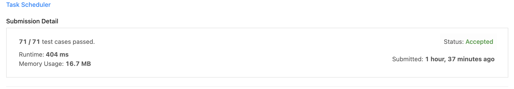
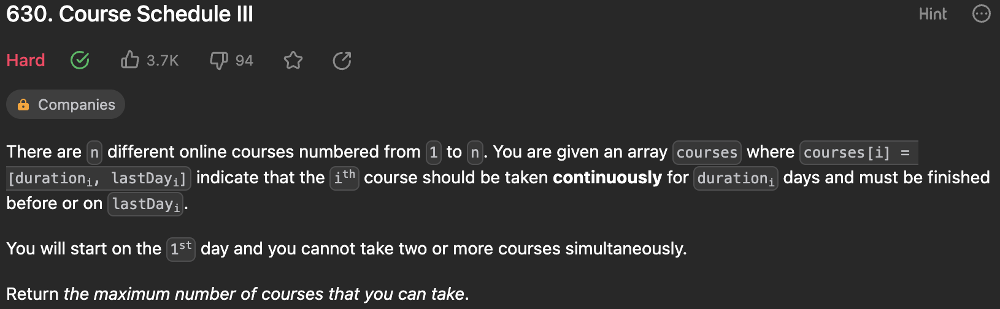
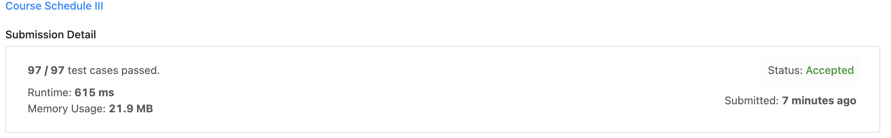

# Greedy_Online_Judge_Questions

Tema:
 - Algoritmos Ambiciosos
 
## Alunos
|Matrícula | Aluno |
| -- | -- |
| 14/0146156 |  João Victor Lustosa Braz |
| 14/0155350  |  Matheus Filipe Faria Alves de Andrade |

## Sobre 
Resolução de exercícios de juiz online referente ao conteúdo de algoritmos ambiciosos da matéria de Projeto de Algoritmos, graduação de Engenharia de Software da Universidade de Brasília (UnB). 

#### Exercício 1: https://leetcode.com/problems/task-scheduler/

#### Exercício 2: https://leetcode.com/problems/course-schedule-iii/

#### Exercício 3: https://www.hackerrank.com/challenges/tree-huffman-decoding/problem 

## Soluções/Submissões
### Exercício 1

### Exercício 2

### Exercício 3

## Instalação 
**Linguagem**: Python 

## Uso 
python3 <nome_do_arquivo.py> 

## Apresentação

A arquivo da apresentação se encontra nesse repositório.

